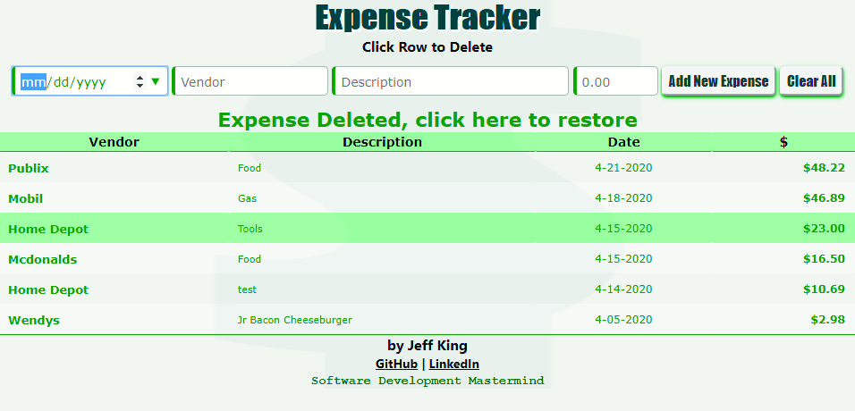

# JavaScript Expense Tracker App

A simple applicatoin to track expenses.  Written entirely in pure JavaScript, HTML, and CSS.  

## Links

[View Application](https://jazfunk.github.io/jk-expense-tracker-app/)  
[View Repository](https://github.com/jazfunk/jk-expense-tracker-app.git)

## Application Images

   
   

## Summary

This application came together rather quickly, and it was a lot of fun.  In an attempt to avoid inundating the user with numerous confirmation, and alert dialogues, I came with up an "undo" operation for the delete functions.  Much like Gmail utilizes when deleting messages; instead of asking to confirm deletion before doing so, we move forward with the delete and then provide functionality to restore the deleted item(s), if desired.  Expenses are saved locally and available the next time a user visits the site.

Additionally, as I've become more proficient with arrow functions, incorporating them has led to much cleaner code, and less global variables.  With creative use of CSS, this application has a smooth look and fast responsiveness. 

Learning how to properly and safely display an object array in a table, using the "createElement()" method was a revelation for me.  Very much looking forward to incorporating the techniques and methods learned whlie developing this app, into future projects.

## Author

- **Jeff King** - _Full Stack Software Developer_ - [GitHub](https://github.com/jazfunk) | [LinkedIn](https://www.linkedin.com/in/jeffking222/)
