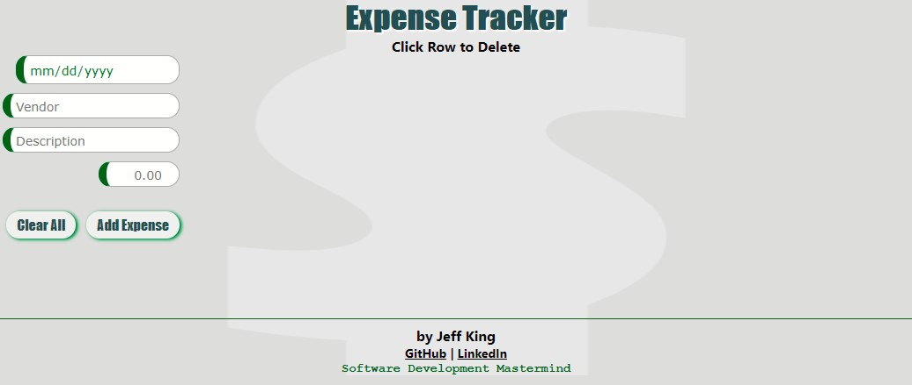
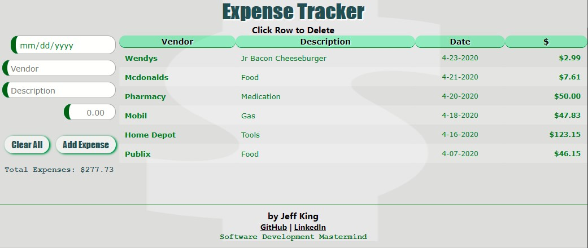

# JavaScript Expense Tracker App

A simple application to track expenses.  Written entirely in pure JavaScript, HTML, and CSS.  

## Links

[View Application](https://jazfunk.github.io/jk-expense-tracker-app/)  
[View Repository](https://github.com/jazfunk/jk-expense-tracker-app.git)  

## Application Images

   
  

## Summary

This application came together rather quickly, and it was a lot of fun to develop, in terms of logic and styling.  

In an attempt to avoid inundating the user with numerous confirmation and alert dialogues, I devised an "undo" operation for the delete functions.  

Similar to deleting messages in Gmail; instead of requesting confirmation, before deletion, we move forward with the delete and then provide functionality to restore the deleted item(s), if desired.  The application will then wait five seconds to remove the temporary objects arrays, and clear displayed messages.

Given more time to develop this project, I would move the undo functionality to the "Add Expense" button.

Expenses are saved locally and available the next time a user visits the site.

Additionally, as I've become proficient with "Arrow Functions", incorporating them has led to cleaner code and fewer global variables.  With creative use of CSS, this application has a smooth look and fast responsiveness. 

In the final analysis, discovering how to properly and safely display an object array in a table using the "createElement()" method was a revelation for me.  The techniques learned whlie developing this application will assuredly be incporated into future projects.

## Author

- **Jeff King** - _Full Stack Software Developer_ - [GitHub](https://github.com/jazfunk) | [LinkedIn](https://www.linkedin.com/in/jeffking222/)
